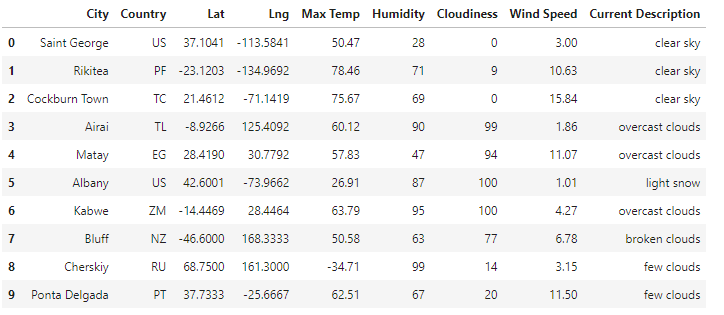

# World_Weather_Analysis
## Overview of the Project
Data from two different application programming interfaces or APIs was collected, filtered and displayed to help potential travelers decide on vacation destinations.  A list of random cities around the world was generated using Python programming and weather information for each city was collected using OpenWeather API.  The cities were filtered using a minimum and maximum temperature range inputed by a user.  From the remaining cities, four cities close together were chosen as a vacation traveling destination.  Lastly, the Google Maps Directions API was used to create a travel route between the four cities as well as a marker layer map.

## Data Examples
The figure below shows an example of data pulled from the OpenWeather API and sorted into a dataframe.  The city, its location, and its weather attributes can be seen in a given row.

Below is an example of a travel route between destinations chosen by user input.  This customn route was generated using the Google Maps Directions API.  

